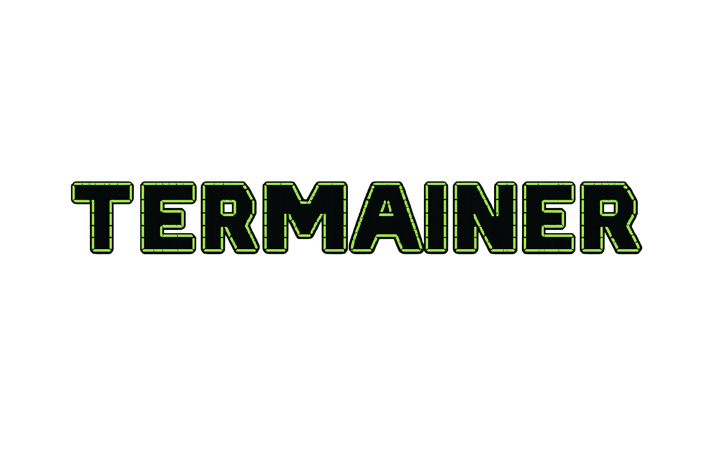

<div align="center">

# Alan Stefanov

### Engineering Manager  · Developer Experience · Platform Engineering · FinOps · Cloud Architecture

Building scalable platforms, leading teams, and optimizing cloud operations.

[](https://www.linkedin.com/in/alanstefanov/)
[](mailto:alan.emanuel.stefanov@gmail.com)
[](https://github.com/AlanStefanov)

</div>

---

<p align="center">
  
</p>

---

<div align="center">

# Termainer

**Container observability and operations directly from your terminal.**

<p align="center">
  
</p>

[](https://github.com/AlanStefanov/termainer)
[](https://www.python.org/)
[](LICENSE)
[](https://pypi.org/project/termainer/)
[](https://hub.docker.com/r/alanstefanov/termainer)
[](https://github.com/AlanStefanov/homebrew-termainer)
[](https://textual.textualize.io/)
[](https://www.linkedin.com/in/alanstefanov/)

<br>

> Everything you need to know about all your containers, in a single terminal.

</div>

---

## Features

| | |
|---|---|
| **📊 Live Stats** | Real-time CPU, memory, and network I/O with sparkline charts |
| **📜 Log Streaming** | Live logs with pause/resume, scroll support, and syntax highlighting |
| **🔍 Full Inspection** | Environment variables, networks, volumes, ports, and configuration |
| **🔌 Multi-Provider** | Supports **Docker**, **Docker Swarm**, **Podman**, **Kubernetes**, and **OpenShift** |
| **📤 Report Export** | Save logs with metadata for debugging and bug reporting |
| **🌐 Remote SSH Connection** | Connect to remote servers (EC2, VPS, etc.) running Docker or K8s |
| **🖥️ Multi-Server** | Monitor multiple remote and local servers simultaneously |
| **⚡ Modern TUI** | Built with Textual and Rich — fast, responsive, and terminal-native |
| **🔄 Container Lifecycle** | Start, stop, restart, and remove containers (Docker/Podman) |

---

## Installation

### From PyPI (recommended)

```bash
pip install termainer
```

### From Docker (ghcr.io — recommended)

```bash
docker run -it -v /var/run/docker.sock:/var/run/docker.sock \
  ghcr.io/alanstefanov/termainer:latest
```

### From Docker Hub (optional)

```bash
docker run -it -v /var/run/docker.sock:/var/run/docker.sock \
  alanstefanov/termainer:latest
```

### From source with install.sh

```bash
git clone https://github.com/AlanStefanov/termainer.git
cd termainer
chmod +x install.sh
./install.sh
```

Make sure `~/.local/bin` is in your `PATH`:

```bash
export PATH="$PATH:$HOME/.local/bin"
termainer
```

### Manual

```bash
git clone https://github.com/AlanStefanov/termainer.git
cd termainer
python -m venv venv
source venv/bin/activate
pip install -r requirements.txt
pip install -e .
termainer
```

### Homebrew (coming soon)

```bash
# Once available in the official tap:
brew install termainer
```

In the meantime you can install manually from the [community tap](https://github.com/AlanStefanov/homebrew-termainer).

---

## Updating

Depending on how you installed Termainer:

| Method | Command |
|--------|---------|
| **pip** | `pip install --upgrade termainer` |
| **Docker (ghcr.io)** | `docker pull ghcr.io/alanstefanov/termainer:latest` |
| **Docker Hub** | `docker pull alanstefanov/termainer:latest` |
| **install.sh** | `cd termainer && git pull && ./install.sh` |

---

## Quick Start

```bash
# Just run it — Termainer auto-detects local Docker, Podman, kubectl, or oc
termainer

# If no local runtime is found, configure remote servers via ~/.ssh/config
# (see below) and restart, or click any technology card to probe SSH servers
```

Termainer works **with zero configuration** for local environments. For remote servers, just add entries to `~/.ssh/config` — no config file needed.

---

## Configuration

### SSH Config Auto-Discovery (Recommended)

Termainer automatically discovers servers from your **`~/.ssh/config`** file. This is the **recommended approach** — no YAML or `.env` file needed.

Simply define your remote servers in `~/.ssh/config`:

```
Host prod-web
    HostName ec2-54-123-45-67.us-east-1.compute.amazonaws.com
    User ubuntu
    IdentityFile ~/.ssh/production.pem

Host staging-k8s
    HostName k8s-staging.example.com
    User admin
    IdentityFile ~/.ssh/staging-key

Host dev-docker
    HostName 192.168.1.100
    User devuser
    IdentityFile ~/.ssh/dev-key
```

Then launch Termainer — all SSH entries appear in the server dropdown automatically:

```bash
termainer
```

When you select a technology card (e.g. "Kubernetes"), Termainer shows a **server selection dialog** with checkboxes for all configured SSH servers. Selected servers are probed **in parallel** for the chosen provider, and successful connections open the dashboard. Server preferences are cached in `~/.config/termainer/provider_servers.json`.

You can also **add and remove servers directly from the UI** via the "Manage servers" button. Custom servers are persisted in `~/.config/termainer/servers.json`.

> **⚠️ Docker/Swarm note:** For Docker and Swarm over SSH, Termainer uses SSH port
> forwarding to tunnel the remote Docker socket to a local Unix socket. The remote
> user must have access to the Docker daemon (be in the `docker` group) without `sudo`.
> Kubernetes, Podman, and OpenShift commands run directly over SSH, no tunnel needed.

### Dashboard server switching

Within a dashboard, switching servers only probes the **current provider** on the target server (no multi-probe). If the server doesn't have that provider, a notification is shown and the dashboard stays on the current server.

#### SSH Authentication Methods

| Method | How to use |
|---|---|
| **Key (`.pem`)** | Set `IdentityFile` in `~/.ssh/config` |
| **Password** | `--ssh-password 'mypass'` or `TERMAINER_REMOTE_PASSWORD` in `.env` (requires `sshpass`) |

For password-based auth, install `sshpass`:

```bash
# Debian/Ubuntu
sudo apt install sshpass

# RHEL/CentOS/Fedora
sudo yum install sshpass
```

### Multi-Server via config.yaml (Advanced)

For advanced setups, create `~/.config/termainer/config.yaml`:

```yaml
lang: en

servers:
  - label: "Local Docker"
    provider: docker
    # No host needed for local Docker

  - label: "Production Web"
    host: ec2-54-123-45-67.us-east-1.compute.amazonaws.com
    user: ubuntu
    key: ~/.ssh/production.pem
    provider: docker

  - label: "Staging K8s"
    host: k8s-staging.example.com
    user: admin
    key: ~/.ssh/staging-key
    provider: kubernetes
```

See the full [Configuration Reference](guide/configuration-reference.md) for all options.

### Single-server via .env

For a quick single remote server, use `.env` or CLI flags:

```bash
termainer --host ec2-54-123-45-67.us-east-1.compute.amazonaws.com \
          --ssh-user ubuntu \
          --ssh-key ~/.ssh/production.pem \
          --provider docker
```

---

## Usage

### Display Tips (Low Resolution)

If your terminal has low vertical space (for example 1366x768), reduce terminal zoom one or two steps before launching Termainer. In most terminals this is Control + Minus.

Termainer also has responsive modes, but zooming out slightly improves readability and avoids panel clipping.

### Local

```bash
# Auto-detect provider
termainer

# Specific provider
termainer --provider docker
termainer --provider swarm
termainer --provider podman
termainer --provider kubernetes
termainer --provider openshift
```

### Remote (SSH)

```bash
# Using --host flag (single server)
termainer --host ec2-54-123-45-67.us-east-1.compute.amazonaws.com \
          --ssh-user ubuntu \
          --ssh-key ~/.ssh/production.pem \
          --provider docker

# Using .env (recommended for frequent single-server use)
cp .env.example .env
# Edit .env with your server details
termainer
```

For multi-server setups, use `~/.ssh/config` entries (see [Configuration](#ssh-config-auto-discovery-recommended)).

### Server Selection & Caching

When you click a technology card (e.g. "Kubernetes") and don't have it locally, Termainer shows:

1. **Server selection modal** — checkboxes for all SSH servers (`~/.ssh/config` + app-added)
   - Pre-selected based on **cached preferences** (`~/.config/termainer/provider_servers.json`)
   - "Manage servers" button to add/remove servers via the UI
2. **Parallel probing** — selected servers are probed simultaneously for the chosen provider
3. **Auto-cache** — successful server-provider mappings are saved for next launch

Within a dashboard, the server dropdown lets you switch servers. Switching only probes the **current provider** on the target server — no unnecessary Docker/K8s/Podman probes.

### Multi-Server Dashboard

When multiple servers are connected (via parallel selection or pre-configured connections), each technology dashboard aggregates its related servers. You can:

- Use the **server dropdown** to select a specific server
- **Switch servers anytime** — only the current provider is probed
- Each container shows its **server name** prefix when in multi-server mode

### Keyboard Shortcuts

#### Technology selection screen

| Key | Action |
|---|---|
| `←` / `↑` / `↓` / `→` | Navigate technologies |
| `Enter` | Open technology dashboard |
| `q` | Quit |

#### Container dashboard

| Key | Action |
|---|---|---|
| `↑` / `↓` | Navigate container list |
| `Enter` | Select container |
| `F5` | Refresh list |
| `p` | Pause/resume logs |
| `e` | Export logs |
| `a` | Start container |
| `t` | Stop container |
| `r` | Restart container |
| `o` | Restart policy |
| `c` | Exec command |
| `Delete` | Remove container |
| `Escape` | Back to technology selection |
| `q` | Quit |

---

## Supported Providers

| Provider | List | Inspect | Stats | Logs | Env Vars | Start/Stop/Restart | Remove |
|---|---|---|---|---|---|---|---|---|
|---|---|---|---|---|---|---|---|
| **Docker** | ✅ | ✅ | ✅ (stream) | ✅ (follow) | ✅ | ✅ | ✅ |
| **Docker Swarm** | ✅ (services) | ✅ | ⚠️ basic | ✅ (service logs) | ✅ | ✅ (scale/update) | ✅ |
| **Podman** | ✅ | ✅ | ✅ (poll) | ✅ (follow) | ✅ | ✅ | ✅ |
| **Kubernetes** | ✅ | ✅ | ✅ (top) | ✅ (follow) | ✅ | ❌ | ✅ |
| **OpenShift** | ✅ | ✅ | ✅ (top) | ✅ (follow) | ✅ | ❌ | ✅ |

All providers work both locally and remotely via SSH.

---

## Architecture

```
CLI (termainer)
  └── app.py              ← CLI args, .env loading, SSH conn
        ├── config_manager.py ← YAML config parser (multi-server)
        ├── server_manager.py ← Multi-server connection manager
        ├── remote/           ← Remote connection module
        │   └── ssh.py        ←   SSH via subprocess (key + password)
        ├── storage.py        ← Persistent cache & user servers (JSON files)
        ├── config.py         ← .env parser and SSH builder
        ├── providers/        ← Multi-provider abstraction layer
        │   ├── base.py       ←   Abstract Protocol
        │   ├── docker.py     ←   Docker CLI (local + remote)
        │   ├── swarm.py      ←   Docker Swarm services (local + remote)
        │   ├── podman.py     ←   Podman CLI (local + remote)
        │   ├── kubernetes.py ←   kubectl (local + remote)
        │   └── openshift.py  ←   oc (extends K8s)
        ├── ui/               ← TUI layer (Textual)
        │   ├── splash.py     ←   Welcome screen
        │   ├── dashboard.py  ←   Main dashboard
        │   ├── widgets.py    ←   Reusable widgets
        │   └── styles.tcss   ←   Stylesheet
        └── utils/
            └── helpers.py    ← Utilities
```

---

## Tech Stack

| Component | Technology |
|---|---|
| Language | Python 3.10+ |
| UI Framework | [Textual](https://textual.textualize.io/) |
| Rendering | [Rich](https://rich.readthedocs.io/) |
| Configuration | YAML (via PyYAML) |
| Providers | Docker CLI, Docker Swarm, Podman CLI, kubectl, oc |
| Remote Access | SSH via subprocess (key + sshpass) |
| Async | asyncio |
| Testing | pytest, pytest-asyncio |
| Linting | Ruff |

---

## Documentation

- [Configuration Reference](guide/configuration-reference.md)
- [Configuration Reference (ES)](guide/configuration-reference-es.md)

---

## Troubleshooting

| Problem | Solution |
|---------|----------|
| **"Not installed" on all technology cards** | No local runtime detected and no SSH servers configured. Add entries to `~/.ssh/config` or use the "Manage servers" button in the app |
| **SSH server shows in dropdown but fails to connect** | Verify the host is reachable (`ssh <alias>`) and the container runtime is installed on the remote host |
| **Docker SSH tunnel fails** | The remote user must be in the `docker` group. Try `ssh <host> docker info` manually |
| **Kubernetes/Podman/OpenShift over SSH not detected** | Ensure the CLI binary (`kubectl`, `podman`, `oc`) is in the remote user's `PATH` |
| **Server selection modal is empty** | No SSH servers configured in `~/.ssh/config` or the app's server manager. Use "Manage servers" to add one |
| **App crashes with "no runtime"** | This was fixed in v0.4.1+. Update to the latest version or just configure SSH servers |

---

## License

MIT — [Alan Emanuel Stefanov](https://github.com/AlanStefanov)

---

<p align="center">
  ⭐ If you like this project, give it a star on GitHub — it helps others discover it!
  <br>
  <a href="https://github.com/AlanStefanov/termainer">github.com/AlanStefanov/termainer</a>
</p>
